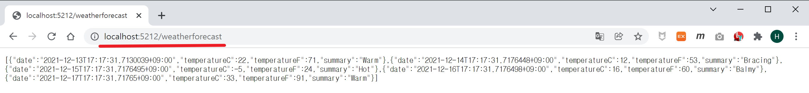
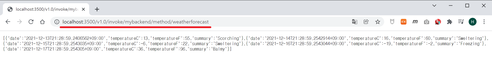
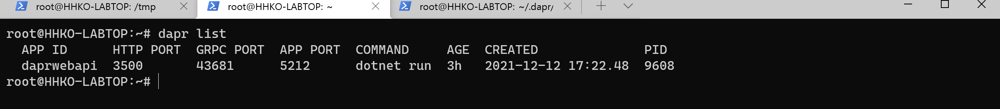
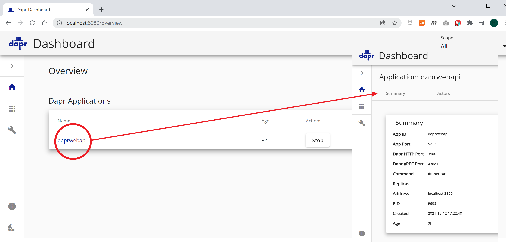

- 소스 : [링크](./MyBackEnd)

## WebAPI C# 프로젝트
```shell
# WebAPI 프로젝트 생성
dotnet new webapi -o MyBackEnd --no-https
cd MyBackEnd
dotnet run
Building...
info: Microsoft.Hosting.Lifetime[14]
      Now listening on: http://localhost:5212
info: Microsoft.Hosting.Lifetime[0]
      Application started. Press Ctrl+C to shut down.
info: Microsoft.Hosting.Lifetime[0]
      Hosting environment: Development
info: Microsoft.Hosting.Lifetime[0]
      Content root path: /github/MyBackEnd/

# WebAPI 호출
http://localhost:5212/weatherforecast
```

- `5212` 포트 사용

## WebAPI Dapr sidecar 실행
```shell
dapr run --app-id myybackend --app-port 5212 --dapr-http-port 3500 dotnet run
ℹ️  Starting Dapr with id myybackend. HTTP Port: 3500. gRPC Port: 43681

...

== APP == Building...
ℹ️  Updating metadata for app command: dotnet run
✅  You're up and running! Both Dapr and your app logs will appear here.

== APP == info: Microsoft.Hosting.Lifetime[14]
== APP ==       Now listening on: http://localhost:5212
== APP == info: Microsoft.Hosting.Lifetime[0]
== APP ==       Application started. Press Ctrl+C to shut down.
== APP == info: Microsoft.Hosting.Lifetime[0]
== APP ==       Hosting environment: Development
== APP == info: Microsoft.Hosting.Lifetime[0]
== APP ==       Content root path: /github/myybackend/

http://localhost:5212/weatherforecast
http://localhost:3500/v1.0/invoke/myybackend/method/weatherforecast
```


- `--app-id` myybackend : Dapr sidecar 식별 이름
- `--app-port` 5212 : WebAPI 프로젝트 포트(**※ WebAPI 포트와 일치해야 한다.**)
- `--dapr-http-port` 3500 : Dapr HTTP API 포트
- `dotnet run` : Dapr 관리 프로세스

## Dapr 주요 명령어
- `dapr list`  
  
- `dapr dashboard`  
  

