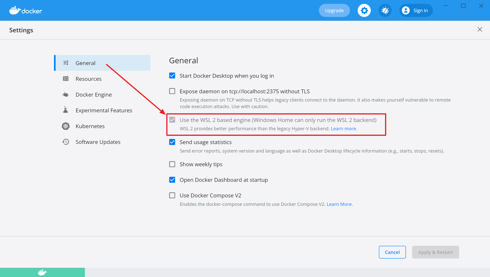
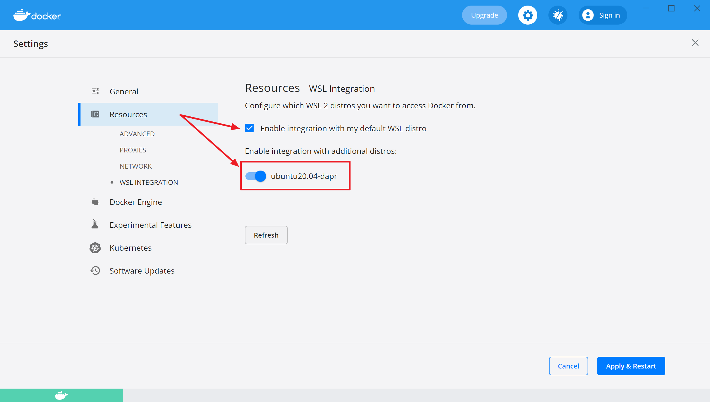

## 명령어 요약
```shell
# 목록
wsl -l -v

# 배포 추가하기
wsl --import `
   ubuntu20.04-dapr `
   C:\Workspace\Dev\Wsl\Ubuntu20.04-Dapr `
   C:\Workspace\Dev\Wsl\Ubuntu20.04-RootFS\focal-server-cloudimg-amd64-wsl.rootfs.tar.gz

# 기본 배포 만들기
wsl --set-default ubuntu20.04-dapr

# 실행(접속)하기
wsl -d ubuntu20.04-dapr

# 특정 계정으로 실행(접속)하기
wsl -d ubuntu20.04-dapr -u hello

# 종료하기
wsl -t ubuntu20.04-dapr

# 배포 제거하기
wsl --unregister ubuntu20.04-dapr

# WSL 종료하기
wsl --shutdown
```

## Windows 10 WSL2 설치
- .. 

## Ubuntu RootFS 파일
- Ubuntu 20.04 LTS - Focal Fossa : [focal-server-cloudimg-amd64-wsl.rootfs.tar.gz](https://cloud-images.ubuntu.com/focal/current/focal-server-cloudimg-amd64-wsl.rootfs.tar.gz)
- Ubuntu 18.04 LTS - Bionic Beaver : [bionic-server-cloudimg-amd64-wsl.rootfs.tar.gz](https://cloud-images.ubuntu.com/bionic/current/bionic-server-cloudimg-amd64-wsl.rootfs.tar.gz)

## Ubuntu RootFS 설치
- `wsl --import` 명령어
  - `wsl --import` `<배포>` `<설치 위치>` `<파일 이름>` `[옵션]`
    - `<배포>` : 식별 이름
    - `<설치 위치>` : Ubuntu 가상화 파일을 생성할 폴더 경로
    - `<파일 이름>` : Ubuntu RootFS 파일 경로
- 폴더 구성
  ```shell
  C:\
   └ Workspace\  
      └ Dev\
        └ Wsl\
          └ Ubuntu20.04-Dapr\      # ...
          └ Ubuntu20.04-RootFS\    # focal-server-cloudimg-amd64-wsl.rootfs.tar.gz
  ```
- 설치 명령어
  ```posershell
  wsl --import `
    ubuntu20.04-dapr `
    C:\Workspace\Dev\Wsl\Ubuntu20.04-Dapr `
    C:\Workspace\Dev\Wsl\Ubuntu20.04-RootFS\focal-server-cloudimg-amd64-wsl.rootfs.tar.gz
  ```
  - `ubuntu20.04-dapr` : 식별 이름
  - `C:\Workspace\Dev\Wsl\Ubuntu20.04-Dapr` : Ubuntu 가상화 파일을 생성할 폴더 경로
  - `C:\Workspace\Dev\Wsl\Ubuntu20.04-RootFS\focal-server-cloudimg-amd64-wsl.rootfs.tar.gz` : RootFS 파일
- 설치 결과
  ```shell
  # 목록 확인
  PS C:\Workspace\Dev> wsl -l -v
    NAME                      STATE           VERSION
  * docker-desktop            Running         2
    ubuntu20.04-dapr          Stopped         2
    docker-desktop-data       Running         2
  ```
- 기본 배포 설정
  ```shell
  # 기본 값으로 지정
  PS C:\Workspace\Dev> wsl --set-default ubuntu20.04-dapr

  # 기본 값 지정 확인
  PS C:\Workspace\Dev> wsl -l -v
    NAME                      STATE           VERSION
  * ubuntu20.04-dapr          Running         2
    docker-desktop            Running         2
    docker-desktop-data       Running         2
  ```
- Ubuntu 20.04 접속
  ```shell
  # ubuntu20.04-dapr 접속
  PS C:\Workspace\Dev> wsl  
  ```

## Docker for Winwodws 설치

